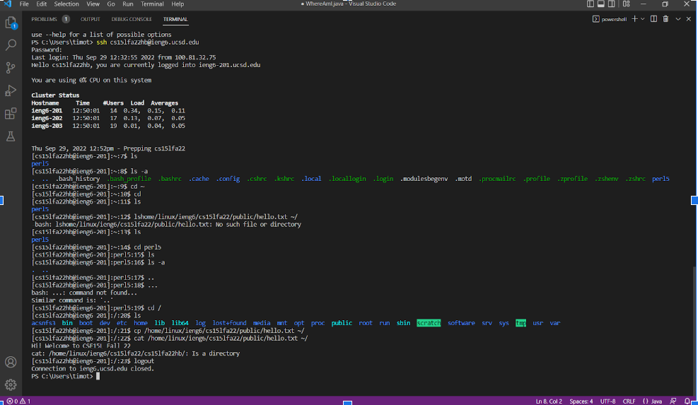

# Installing VScode
- Go to the VScode website to the download page.
- Download VScode and ensure you can open the terminal inside of it by pressing Ctrl + `
- 

# Remotely Connecting
- Now to remote connect you must use the [account lookup](https://sdacs.ucsd.edu/~icc/index.php) and install [OpenSSH](https://learn.microsoft.com/en-us/windows-server/administration/openssh/openssh_install_firstuse?tabs=gui)
- After finding your account name and setting the password you use the account name to SSH into the terminal inside of VScode
- For example ssh cs15lfa22gx@ieng6.ucsd.edu
- Input the password that you set and wait for the login page
- 

# Running Commands
- After a successful login you can run many different commands to help navigate the file directory
- cd is used to change directory
- ls is to list the contents inside the directory you are in (Note there are different actions you can do such as -a and -lat that show more information)
- cp copies files from a directory to a different directory that you set
- cat prints a files contents
- To logout from the PC you must use exit or Ctrl + D

# Moving files with SCP
- You can use the scp command to move files over to the remote desktop
- To do this you must use the following command structure
- scp WhereAmI.java cs15lfa22zz@ieng6.ucsd.edu:~/
- In this example you can see that WhereAmI.java is the file we are coping and that at the end we have the directory we are coping it over too
- 

# SSH Keys
- Create an ssh key by using the command ssh-keygen and setting the path to the key to be /Users/[Your Username]/.ssh/id_rsa
- On windows you also have to follow the steps of [ssh-add](https://docs.microsoft.com/en-us/windows-server/administration/openssh/openssh_keymanagement#user-key-generation)
- After creating the key remote into the desktop and then create a new directory for all ssh keys
- Use the commands mkdir .ssh then logout
- After that you will scp the key into that directory 
- scp /Users/[Your Username]/.ssh/id_rsa.pub cs15lfa22gx@ieng6.ucsd.edu:~/.ssh/authorized_keys
- Now you should be able to access the remote desktop without using a password
- 

# Optimizing Remote Running
- Now you can run commands directly onto the remote desktop by using quotes around the command
- $ ssh cs15lfa22gx@ieng6.ucsd.edu "ls"
- You can also use semicolons to run multiple commands from the same line
- cp WhereAmI.java OtherMain.java; javac OtherMain.java; java WhereAmI
- Using these methods will make it easier to run commands in the terminals
- 

