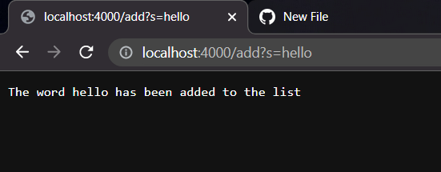
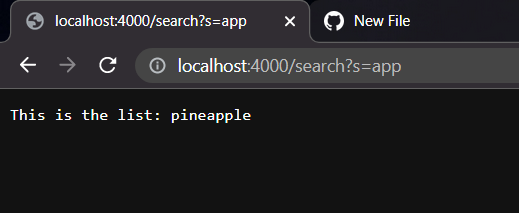

# Part 1: SearchEngine

- Here is my code for my SearchEngine


```
class Handler implements URLHandler {
    // The one bit of state on the server: a number that will be manipulated by
    // various requests.
    String s = "";

    public String handleRequest(URI url) {

        
        if (url.getPath().equals("/")) {
            return String.format("This is the main page");
        } else {
            System.out.println("Path: " + url.getPath());
            if (url.getPath().contains("/add")) {
                String[] parameters = url.getQuery().split("=");
                if (parameters[0].equals("s")) {
                    s += parameters[1] + ",";
                    return String.format("The word %s has been added to the list", parameters[1]);
                }
            }
            if (url.getPath().contains("/search")){
                String contains = "";
                String[] parameters = url.getQuery().split("=");
                if(parameters[0].equals("s")){
                    String[] list = s.split(",");
                    for (String l : list){
                        if(l.contains(parameters[1])){
                            contains += l + " ";
                        }
                    }
                    return String.format("This is the list: %s", contains);
                }
            }
            return "404 Not Found!";
        }
    }
}


class SearchEngine {
    public static void main(String[] args) throws IOException {
        if(args.length == 0){
            System.out.println("Missing port number! Try any number between 1024 to 49151");
            return;
        }

        int port = Integer.parseInt(args[0]);

        Server.start(port, new Handler());
    }
}
```

- This Screenshot shows the addition of the word hello onto the list of strings
- When running the URL the methods `getPath() .equals() and .format()` are called to get to the page 
- After these methods run and show the page the values for the string changes in this case `s = hello` which means s contains hello inside of it
- The word was added onto the list and is stored within the program

---
- This Screenshot shows the addition of the word pineapple onto the list of strings
- It does the same thing as the previous screenshot with adding the word pineapple onto the string
- Calling the same methods to determine how it will be added using `getPath() .equals() and .format()` and also using `s += parameters[1] + ",";` to add into the string list
- This changes the value of `s` to contain both the word hello and pineapple which makes `s = hello,pineapple`

---
- This Screenshot shows the query `/search` being used to search for certain characters in the list
- In this query the methods that are called are `.getQuery() .equals() .getPath() and .split()` 
- These methods are used to not change any values but instead to search the string `s` to see if it contains the certain characters which are `app` in this case
- The query then searches through the list using `.split` and a for loop to print out a new string that only contains words with the characters
- This query does not change `s` it will still contain both hello and pineapple but only pineapple will print since it meets the requirements for it to be printed




# Part 2: Symptoms and Failure-inducing Inputs

- In the method `reverseInPlace` for the ArrayExamples the code would not work when you inputed an array with any number of elements
```
public class ArrayTests {
	@Test 
	public void testReverseInPlace() {
    int[] input1 = { 3 }; // This test works before bug fix
    ArrayExamples.reverseInPlace(input1);
    assertArrayEquals(new int[]{ 3 }, input1);

    int[] input2 = {1,2,3,4,5}; //This test does not work before bug fix
    ArrayExamples.reverseInPlace(input2);
    assertArrayEquals(new int[]{5,4,3,2,1}, input2);

    int[] input3 = {2,1,4,6}; //This test does not work before bug fix
    ArrayExamples.reverseInPlace(input3);
    assertArrayEquals(new int[]{6,4,1,2}, input3);

	}
```
- The method `reverseInPlace` has a bug where it only reverses one half of the list
- For example if the list was `{1,2,3,4,5}` it will return `{5,4,3,4,5}`


```
static void reverseInPlace(int[] arr) {
    for(int i = 0; i < arr.length; i += 1) {
      arr[i] = arr[arr.length - i - 1]; // This is where the bug happens
    }
  }
 ```
 
 
 - We will have to create a temp variable to be able to switch the variables and reverse the order which can be seen in the code below


```
static void reverseInPlace(int[] arr) {
    int c = 0;
    for(int i = 0; i < arr.length/2 ; i += 1) {
      c = arr[i];
      arr[i] = arr[arr.length - i - 1];
      arr[arr.length - i - 1] = c;
    }
    
  }
 ```
 
- This bug clearly does not have anything to store the old values that it switches and only uses the same array to determine the changes
- Since it needs to have somewhere to store the values it will not be able to reverse since the arr will end up having values that equal each other

---

- The method `filter` in the ListExamples has a bug 
- These are the tests that are ran to create a bug

```
import static org.junit.Assert.*;
import org.junit.*;
import java.util.ArrayList;
import java.util.List;


class StringLongerThan implements StringChecker {
    @Override
    public boolean checkString(String s) {
        return s.length() > 4;
    }
}


public class ListTests{
    @Test
    public void listTest() {

        List<String> s = new ArrayList<>();
        s.add("abc");
        s.add("12345");
        s.add("123456");
        
        List<String> out = new ArrayList<>();
        out.add("12345");
        out.add("123456");
        assertEquals(out, ListExamples.filter(s, new StringLongerThan())); // This tests causes the bug
    }


}
 
```
 
- This is the code with the bug

```
static List<String> filter(List<String> list, StringChecker sc) {
    List<String> result = new ArrayList<>();
    for(String s: list) {
      if(sc.checkString(s)) {
        result.add(0, s); // This is where the bug is produced
      }
    }
    return result;
  }
  ```
- This is the code that fixes the bug

```
static List<String> filter(List<String> list, StringChecker sc) {
    List<String> result = new ArrayList<>();
    for(String s: list) {
      if(sc.checkString(s)) {
        result.add(s);
      }
    }
    return result;
  }
 ```
 - In this situation it is a very simple mistake that is causing the bug
 - The point of the method is to keep the same order of which the filter is made with `checkString`
 - The problem is that the original code inserts the strings in the front instead of adding any new strings to the back of the list to keep the same order
 - Since it used an index instead of just using add like it normally works it caused the bug of having the reversed order instead of the right one


